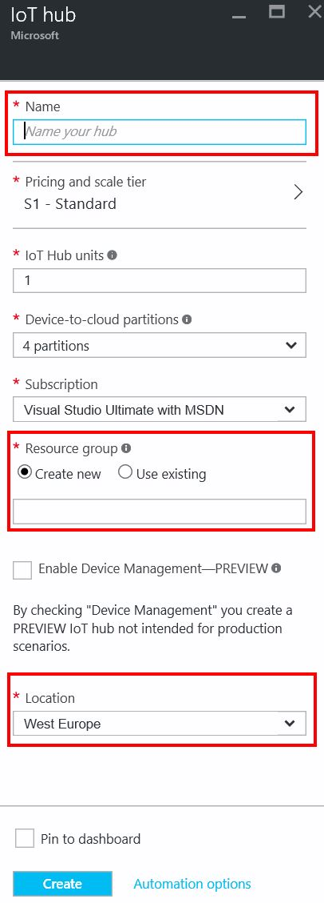
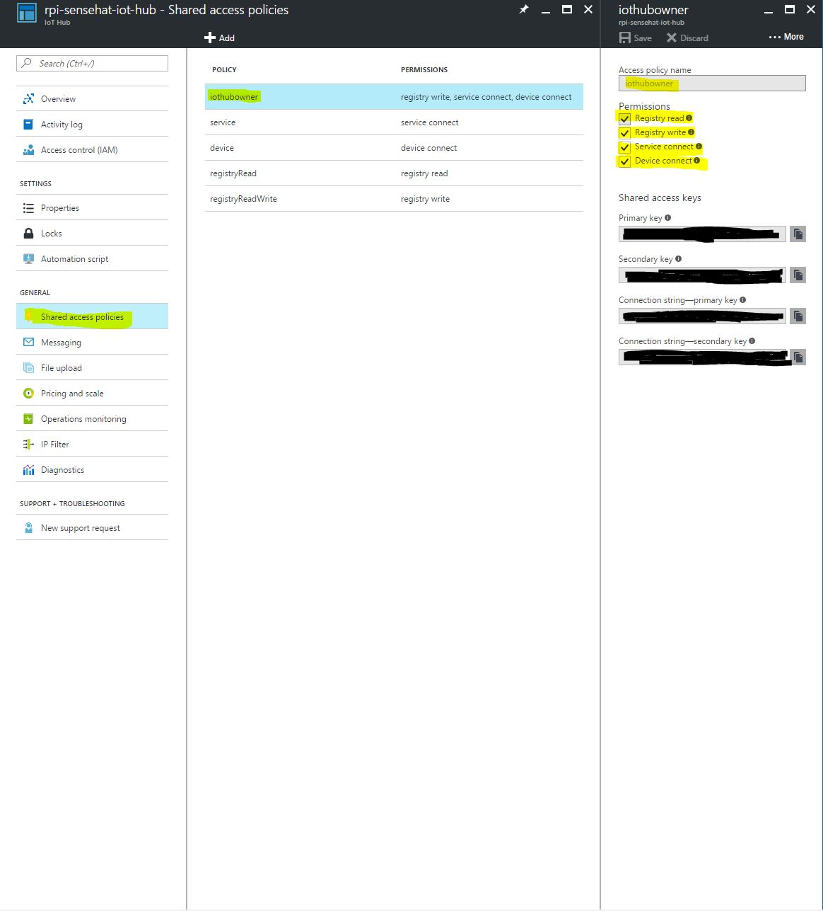

Azure IoT Hub
==============

What is Azure IoT Hub?
-----------------------

> Azure IoT Hub is a fully managed service that enables reliable and secure bidirectional communications between millions of IoT devices and a solution back end. Azure IoT Hub:

> - Provides multiple device-to-cloud and cloud-to-device communication options, including one-way messaging, file transfer, and request-reply methods.
> - Provides a queriable storage for device metadata and synchronized state information.
> - Enables secure communications and access control using per-device security keys or X.509 certificates.
> - Provides extensive monitoring for device connectivity and device identity management events.
> - Includes device libraries for the most popular languages and platforms.

> In addition to a rich set of **device-to-cloud** and **cloud-to-device** communication options, including messaging, file transfers, and request-reply methods, Azure IoT Hub addresses the device-connectivity challenges in the following ways:

> - Device twins. Using Device twins, you can store, synchronize, and query device metadata and state information. Device twins are JSON documents that store device state information (metadata, configurations, and conditions). IoT Hub persists a device twin for each device that you connect to IoT Hub.

> - Per-device authentication and secure connectivity. You can provision each device with its own security key to enable it to connect to IoT Hub. The IoT Hub identity registry stores device identities and keys in a solution. A solution back end can add individual devices to allow or deny lists to enable complete control over device access.

> - Monitoring of device connectivity operations. You can receive detailed operation logs about device identity management operations and device connectivity events. This monitoring capability enables your IoT solution to identify connectivity issues, such as devices that try to connect with wrong credentials, send messages too frequently, or reject all cloud-to-device messages.

> - An extensive set of device libraries. Azure IoT device SDKs are available and supported for various languages and platforms - C for many Linux distributions, Windows, and real-time operating systems. Azure IoT device SDKs also support managed languages, such as C#, Java, and JavaScript.

> - IoT protocols and extensibility. If your solution cannot use the device libraries, IoT Hub exposes a public protocol that enables devices to natively use the MQTT v3.1.1, HTTP 1.1, or AMQP 1.0 protocols. You can also extend IoT Hub to provide support for custom protocols by:
>  - Creating a field gateway with the Azure IoT Gateway SDK that converts your custom protocol to one of the three protocols understood by IoT Hub.
>  - Customizing the Azure IoT protocol gateway, an open source component that runs in the cloud.

> - Scale. Azure IoT Hub scales to millions of simultaneously connected devices and millions of events per second.

> More information on the [Official Microsoft Documentation](https://docs.microsoft.com/en-us/azure/iot-hub/iot-hub-what-is-iot-hub).

Creating an Azure IoT Hub
-------------------------

First you need to [sign in to the Azure Portal](https://portal.azure.com/). Then click **New --> Internet of Things --> Azure IoT Hub**.

In the IoT Hub blade, choose the configuration for your IoT Hub:

- In the **Name** box, enter a name for your IoT hub. If the **Name** is valid and available, a green check mark appears in the Name box.
- Select a pricing and scale tier. This tutorial does not require a specific tier. For this tutorial, **use the free F1 tier**.
- **In Resource group**, create a new resource group, or select an existing one. For more information, [see Using resource groups to manage your Azure resources](https://docs.microsoft.com/en-us/azure/azure-resource-manager/resource-group-portal).
- In Location, select the location to host your IoT hub. For this tutorial, choose your nearest location.

After you configured your IoT Hub, click **Create**. After it has been successfully created, you can click the newly created tile to open the blade.

Access control and persmissions
-------------------------------

You must have appropriate permissions to access any of the IoT Hub endpoints. For example, a device must include a token containing security credentials along with every message it sends to IoT Hub.

You can define your own policies, but a newly created IoT Hub comes with the following default policies:

- **iothubowner**: Policy with all permissions.
- **service**: Policy with ServiceConnect permission.
- **device**: Policy with DeviceConnect permission.
- **registryRead**: Policy with RegistryRead permission.
- **registryReadWrite**: Policy with RegistryRead and RegistryWrite permissions.
- **Per-device security credentials**. Each IoT Hub contains an identity registry. For each device in this identity registry, you can configure security credentials that grant **DeviceConnect** permissions scoped to the corresponding device endpoints.

> [More on the Azure IoT Hub Security in the Official Microsoft Documentation.](https://docs.microsoft.com/en-us/azure/iot-hub/iot-hub-devguide-security)

Since this is a demo, we will use the **iothubowner** policy, but keep in mind that you should only grant the desired level of access to various devices.

Later when we will send data to the IoT Hub from our devices, we will need **Connection string - primary key**.

Next Steps
----------

Next, we will send data from our devices (real or simulated data) to the IoT Hub we just created using the connection string.

> [You can find the step-by-step tutorial on how to build the UWP application using C# here.](../windows10-iot/session03/readme.md)

> [You can find the step-by-step tutorial on how to build the Python application here.](link-to-python-application)