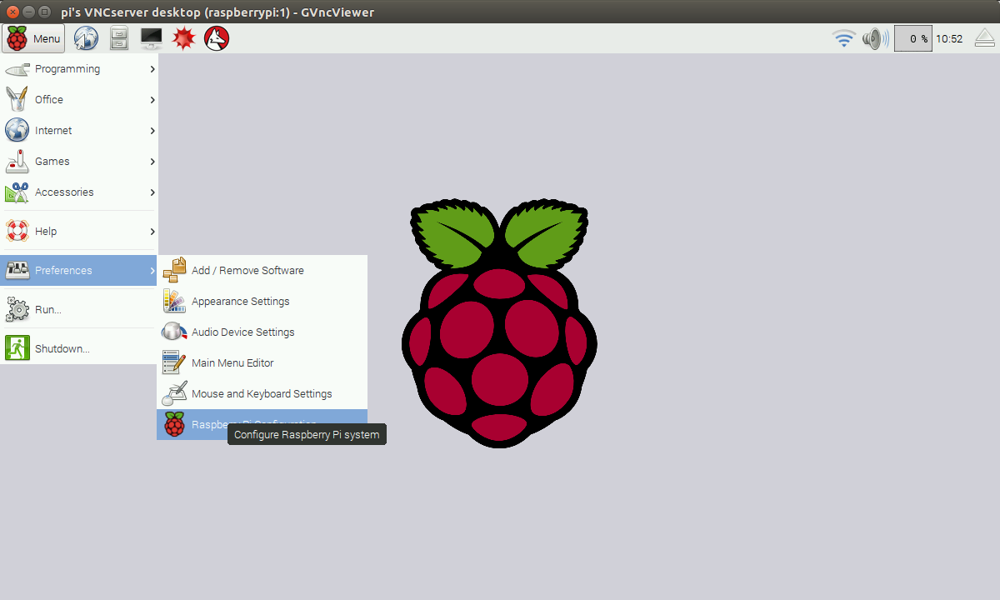

Raspbian
========

Introduction
------------

Raspbian is an operating system based on Debian that is optimized for the Raspberry Pi hardware.

> You can [find more about Raspbian on their official organization website](https://www.raspbian.org/).

Session 1 - [Getting your development environment ready](session01/readme.md)
-----------------------------------------------------------------------------

In this session we will go through the process of installing Raspbian on a Raspberry Pi 3.

Session 2 - [Sending Device-to-Cloud messages](session02/readme.md)
-----------------------------------------------------------------

In this session we will build a simple Python application that sends data to the IoT Hub.

Session 3 - [Sending Cloud-to-Device messages](session03/readme.md)
-----------------------------------------------------------------

In this session you will build a Python application that receives device-to-cloud communication.