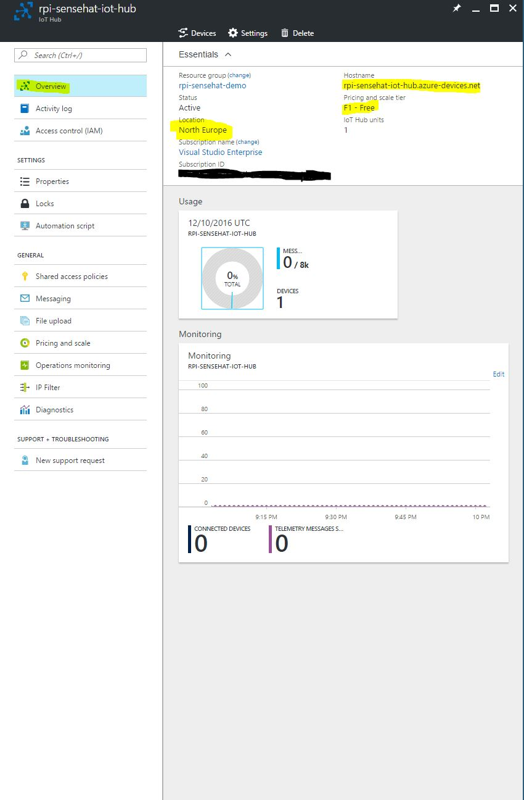

Session 2 - Sending Device-to-Cloud messages
============================================

In this session we will build a simple Python application that sends data to the IoT Hub.

First of all, you need to create an Azure IoT Hub. In order to do this, [follow this detailed step-by-step tutorial](../../common/azure-iot-hub.md).

After you created the IoT Hub, should see something similar to this:



Installing a Device Explorer
----------------------------

When working with Windows there is a GUI little program that allows the management and monitoring of the devices connected to an Azure IoT Hub.

> If you are running on Windows you can [download the application from here and install it.](https://github.com/Azure/azure-iot-sdks/releases/download/2016-11-17/SetupDeviceExplorer.msi)

If you are running inside Linux or macOS, there is a command line tool called `iothub-explorer`, a CLI tool to manage device identities in your IoT hub registry, send and receive messages and files from your devices, and monitor your IoT hub operations.

> [The source of the package can be found here](https://github.com/Azure/iothub-explorer).

> Note: This tool requires Node.js version 4.x or higher for all features to work.

To install the tool, execute `npm install -g iothub-explorer`.

```
$ iothub-explorer help

  Usage: iothub-explorer [options] <command> [command-options] [command-args]


  Commands:

    login                           start a session on your IoT hub
    logout                          terminate the current session on your IoT hub
    list                            list the device identities currently in your IoT hub device registry
    create <device-id|device-json>  create a device identity in your IoT hub device registry
    delete <device-id>              delete a device identity from your IoT hub device registry
    get <device-id>                 get a device identity from your IoT hub device registry
    import-devices                  import device identities in bulk: local file -> Azure blob storage -> IoT hub
    export-devices                  export device identities in bulk: IoT hub -> Azure blob storage -> local file
    send <device-id> <message>      send a message to the device (cloud-to-device/C2D)
    monitor-feedback                monitor feedback sent by devices to acknowledge cloud-to-device (C2D) messages
    monitor-events [device-id]      listen to events coming from devices (or one in particular)
    monitor-uploads                 monitor the file upload notifications endpoint
    monitor-ops                     listen to the operations monitoring endpoint of your IoT hub instance
    sas-token <device-id>           generate a SAS Token for the given device
    simulate-device <device-id>     simulate a device with the specified id
    help [cmd]                      display help for [cmd]

  Options:

    -h, --help     output usage information
    -V, --version  output the version number
```

> If you don't want to install npm tools globally on your machine and you are familiar with Docker, I created an image that contans `iothub-explorer` that is based on the base Ubuntu image with Node.

> In order to run the image, simply execute `docker run -it radumatei/iothub-explorer` and you should have a working container with `iothub-explorer`.


Working with `iothub-explorer`
------------------------------

First of all, we need to login: 
`iothub-explorer login "<iot-hub-connection-string>"`

For example, if we want to monitor the incoming events for a hub we execute: 

`iothub-explorer monitor-events --login <iot-hub-connection-string>`

Send device to cloud messages
-----------------------------

First of all, we will send very simple messages (and not yet temperature telelemtry).

After cloning this repository, go to the  `raspbian/session02/device-to-cloud` folder and explore the `deviceClient.py` file. It is built on the IoT Hub REST API and the method we will use for this session is `send`.

Let's create a file, `send-simple-message.py` and add the following:

```
from deviceClient import DeviceClient

KEY = "device-primary-key";
HUB = "iot-hub-name";
DEVICE_NAME = "device-name";


device = DeviceClient(HUB, DEVICE_NAME, KEY)
device.create_sas(600)

print(device.send(b"{message: 'This is awesome! Hello from Python!'}"))
```
