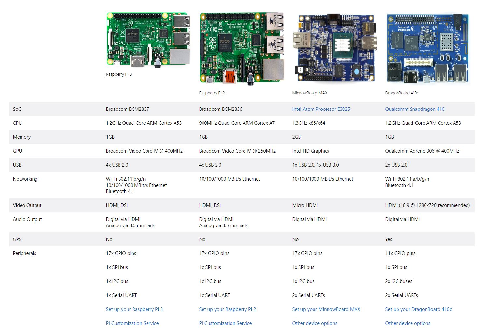

Windows 10 IoT Core
===================

Introduction
------------

Windows 10 IoT Core is a version of Windows 10 that is optimized for smaller devices with or without a display, and that runs on the Raspberry Pi 2 and 3, Arrow DragonBoard 410c & MinnowBoard MAX. Windows 10 IoT Core utilizes the rich, extensible Universal Windows Platform (UWP) API for building great solutions.  

One of the main advantages of Windows 10 IoT Core is that it allows you to run UWP applications - applications that you write once and can run on laptops, tablets, phones, XBox, IoT devices or even on HoloLens.

UWP apps just work on IoT Core, just as they do on other Windows 10 editions. A simple, blank Xaml app in Visual Studio will properly deploy to your IoT Core device just as it would on a phone or Windows 10 PC. All of the standard UWP languages and project templates are fully supported on IoT Core.

In addition to the traditional UI apps, IoT Core has added a new UWP app type called “Background Applications”. These applications do not have a UI component, but instead have a class that implements the “IBackgroundTask” interface. They then register that class as a “StartupTask” to run at system boot. Since they are still UWP apps, they have access to the same set of APIs and are supported from the same language. The only difference is that there is no UI entry point.

Session 1 - [Getting your development environment ready](session01/readme.md)
-----------------------------------------------------------------------------

In this session we will go through the process of installing Windows 10 IoT Core on a Raspberry Pi 3.

Session 2 - [Getting started with UWP and Windows IoT Core](session02/readme.md)
---------------------------------------------------------------------------------