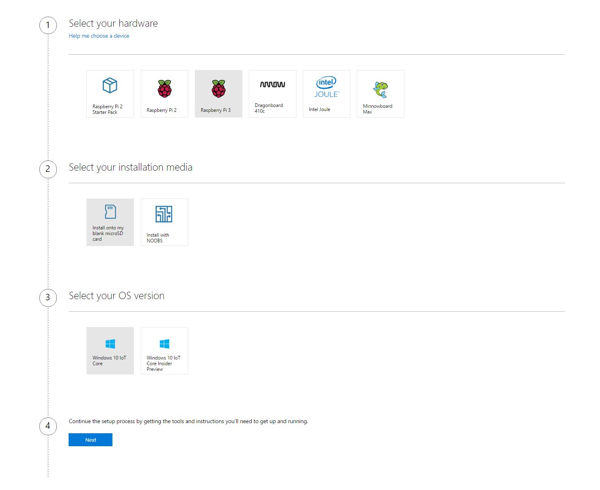
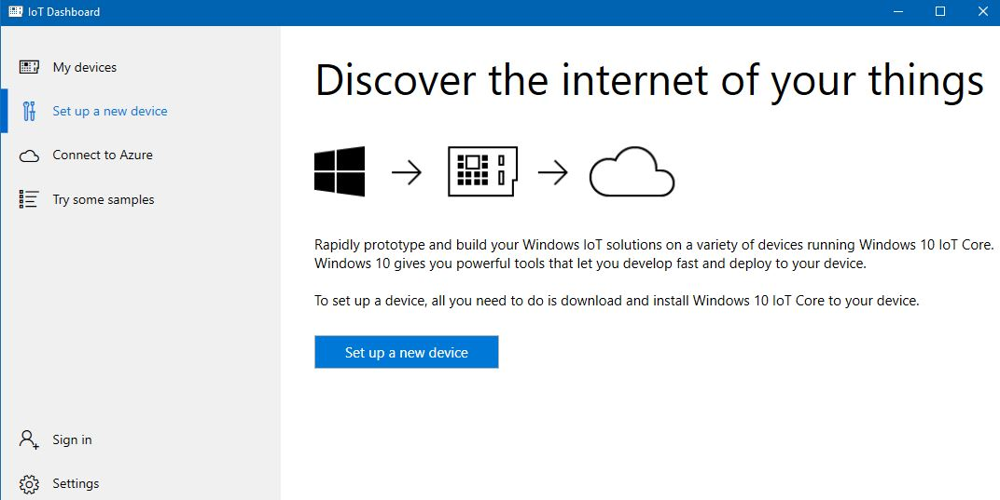
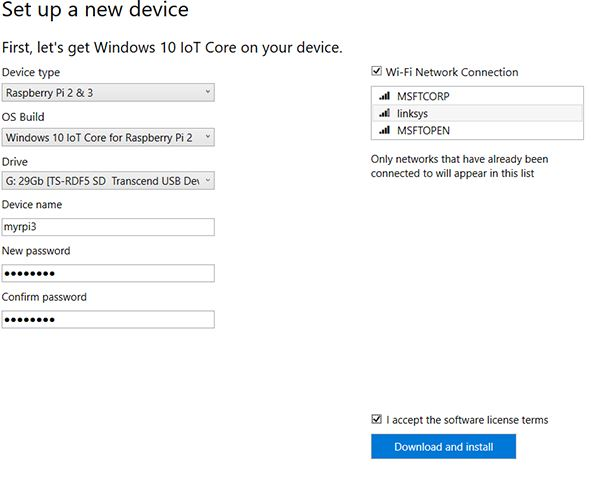
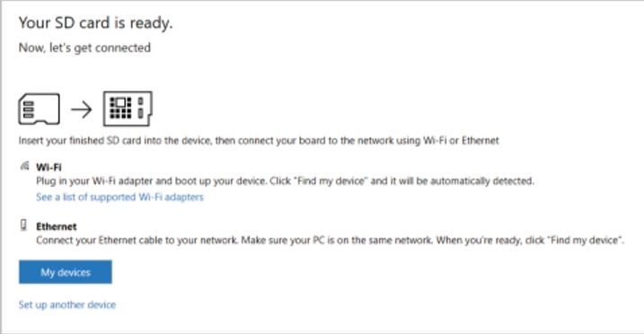
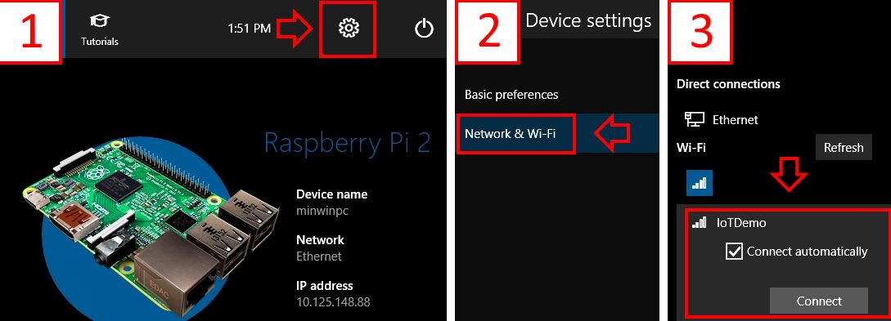
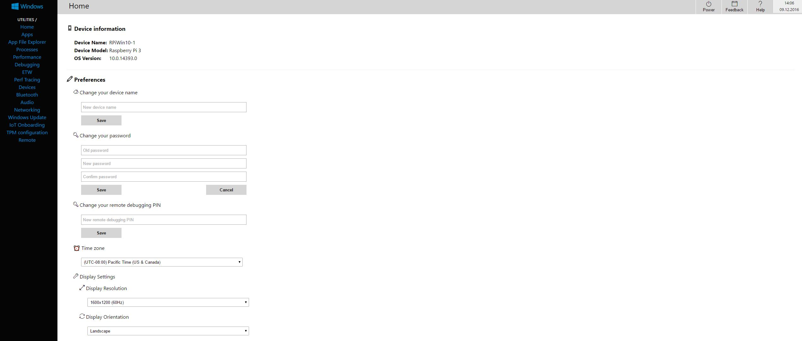

Session 1 - Getting your development environment ready
======================================================

In this session we will go through the process of installing Windows 10 IoT Core on a Raspberry Pi 3.

To get started, go [start at this page that shows the step-by-step process](https://developer.microsoft.com/en-us/windows/iot/GetStarted), pick your Raspberry Pi (it can be either a Raspberry Pi 2 or 3), select wether you want to install on a clean microSD card or install using NOOBS and select the version of Windows IoT Core you want on your board: the stable of preview version.

Step 1 of 3: Get the tools
--------------------------

First of all, you need to be running Windows 10 on your laptop. If you're not running Windows 10 (version 10.1.10240) you can [upgrade from here](https://www.microsoft.com/en-us/software-download/windows10).

Then, you need to Download and Install the Windows 10 IoT Core Dashboard application. 

This application allows you to see all your connected devices along with the IP and MAC addresses, connect to them via the web interface or via PowerShell, connect to Azure resources such as IoT Hub and register our device (more on this later) or run samples directly on our Raspberry Pi.
Using this application we will also create the bootable microSD card with Windows 10 IoT Core.

Step 2 of 3: Set up your device
-------------------------------

In this step you will download, flash and install Windows 10 IoT Core on the board using the IoT Core Dashboard application you just installed.

Open the IoT Core Dashboard application, click Set up a new device and select your version of Raspberry Pi (in this case 3). 

> Remember that each board has its own specialized image, so you won't be able to run the image for Raspberry Pi 3 on a Raspberry Pi 2 or the other way around.

Insert a compliant microSD card of at least 8GB (of recommended Class 10). Then enter a device name, password and Wi-Fi network to connect to.

Accept the terms and the application should start downloading the Windows image suitable for Raspberry Pi 3 (at the moment of writing this, the size of the image is aproximately 600 MB) and the installation process will carry on automatically (with some additional prompts for admin when starting to flash the card).

When it fisinshes installing the operating system on the microSD card, it will tell you so and will prompt you to start your board.

At this point you should start the board and connect it to the network. As always, connecting it through ethernet is recommended because of its reliability, but connecting through Wi-Fi will also work (if your board is equipped with Wi-Fi - Raspberry Pi 3 is).

- If you connect through ethernet, the board should automatically connect to the network. Just go to the IoT Core Dashboard application under My Devices and the board should be visible.

- If you connect through Wi-Fi, you should start the board, connect it to a monitor, keyboard and mouse and connect to a network as in the image below. This only has to be done the first time as the board remembers the network it connected to.

> [Photo source here.](https://az835927.vo.msecnd.net/sites/iot/Resources/images/SetupWiFi/DefaultAppWiFiConfig.png)

What if my board is connected to network but doesn't show in the IoT Dashboard application?
-------------------------------------------------------------------------------------------

If there are multiple routers or firewalls inside your network, most likely your board will not show up in the IoT Dashboard application, even if it is properly connected to the network. In this case, we will make use of the command line:

- on a Windows computer, start a new PowerShell session and execute the following command: `arp -a | sls b8-27-eb` or ``arp -a | Select-String b8-27-eb`
- on a Linux or Mac computer, start a new Bash session and execute the following command: `arp -a | grep "b8:27:eb"`

In both cases, the command will execute the `arp -a` command will display all network entries for all network interfaces. The `sls`/`Select-String` and `grep` will search the output of the `arp` command for the specific MAC address of all Raspberry Pi boards that starts with `B8:27:EB`. Running this command will allow you to see the IP of your board without attaching it to a display.

Connecting to the board
------------------------

At this point, there are multiple ways you can connect to your board in order to manage it: 

- connect to the web interface of the Raspberry Pi - to do this, go to a browser and navigate to the address of your Raspberry Pi followed by the `8080` port. If the IP address of your board is `192.168.1.3`, then navigate to `192.168.1.3:8080` and you will be prompted to enter the login details you provided when installing the operating system on the microSD card. Then, you should be able to administrate the board from the browser.

- connect using the Windows IoT Remote Client - first you should enable the Remove Server that allows the connection using a client application.

Then, [install the Windows IoT Remote Client from the Windows Store](https://www.microsoft.com/store/apps/9nblggh5mnxz) and connect using the IP address of your board.

- connect using SSH (Secure Shell) - this allows you to remotely administer and configure the board using a command-line interface. First, you need a SSH client. If you are on a Linux, Mac or have installed Bash on Windows 10, then the SSH client should be already installed. [Otherwise, install a client such as PuTTY](http://the.earth.li/~sgtatham/putty/latest/x86/putty.exe).

Then, connect to the board using the Administrator credentials:

`ssh Administrator@your-board-ip` - at this point, you should have the full command line interface of the Raspberry.

Step 3 of 3: Set up Visual Studio
----------------------------------

First of all, [download and install Visual Studio Community 2015 from here](http://go.microsoft.com/fwlink/?LinkID=534599) and install Update 3 (if necessary). 

Then, [download and install the Windows IoT Core Project Templates from Visual Studio Gallery](https://marketplace.visualstudio.com/items?itemName=MicrosoftIoT.WindowsIoTCoreProjectTemplates).

[Enable the developer mode on the device running Visual Studio by following the instructions here].(https://msdn.microsoft.com/windows/uwp/get-started/enable-your-device-for-development).
