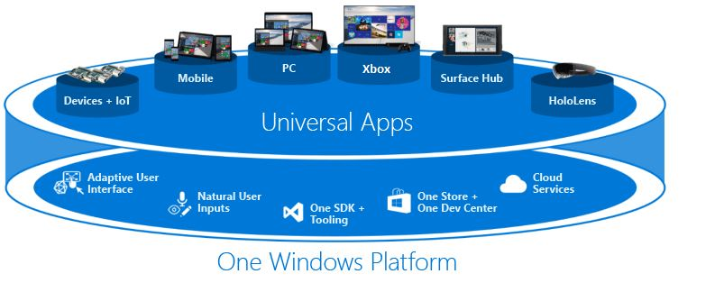
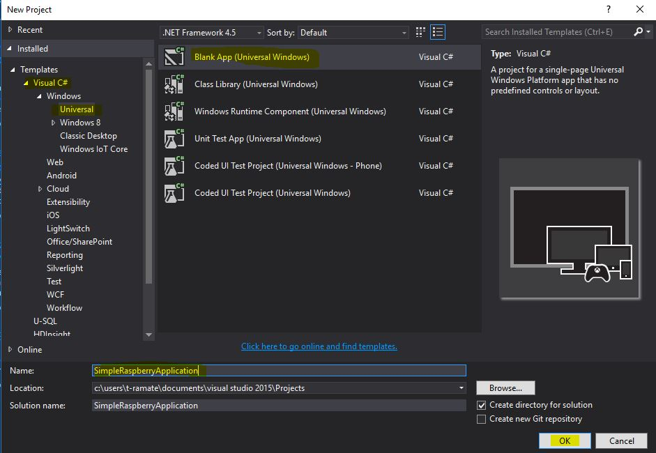
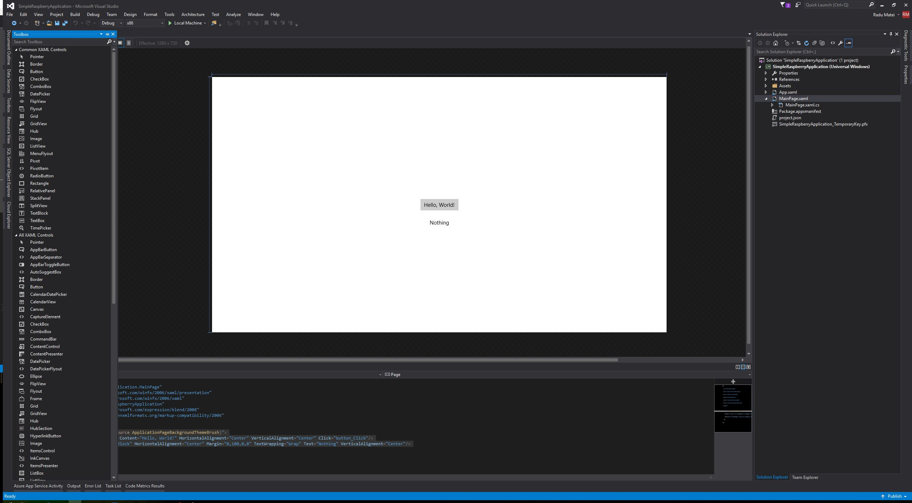
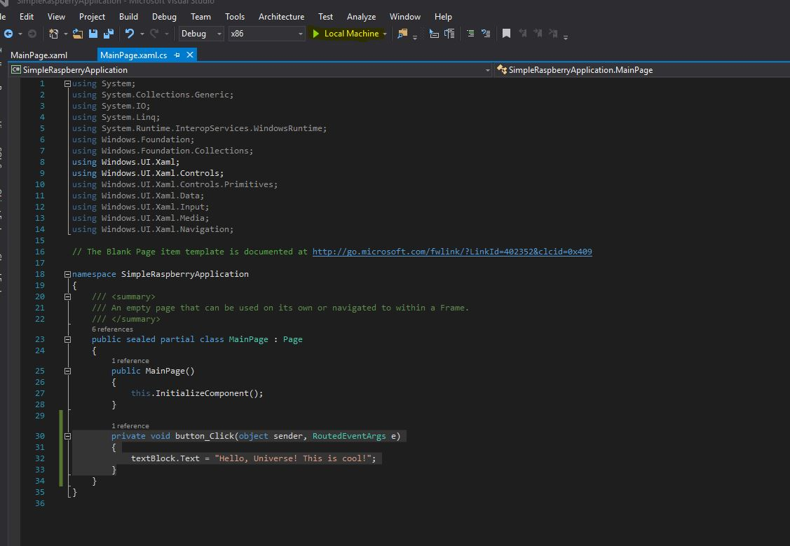
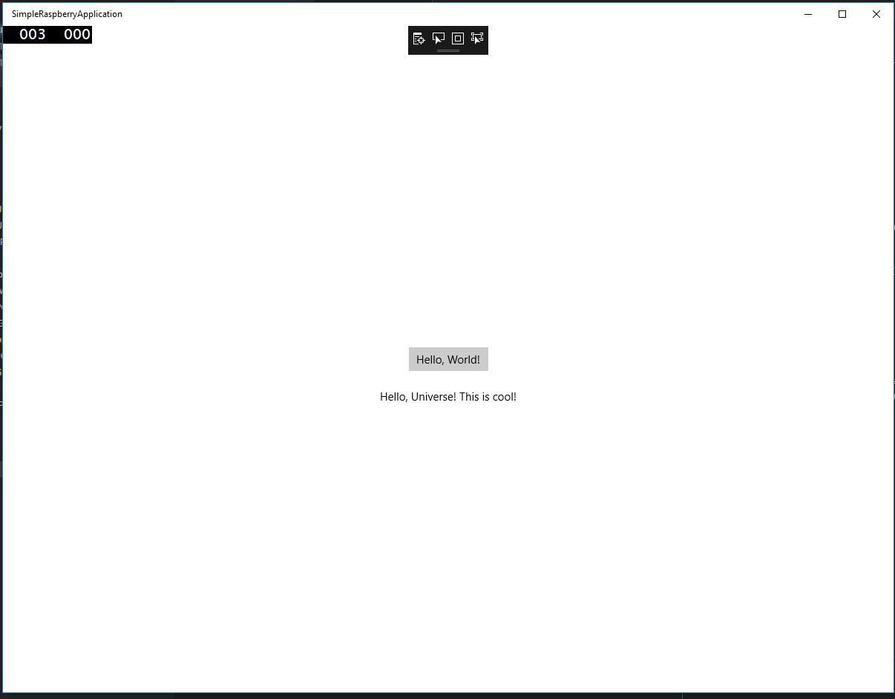
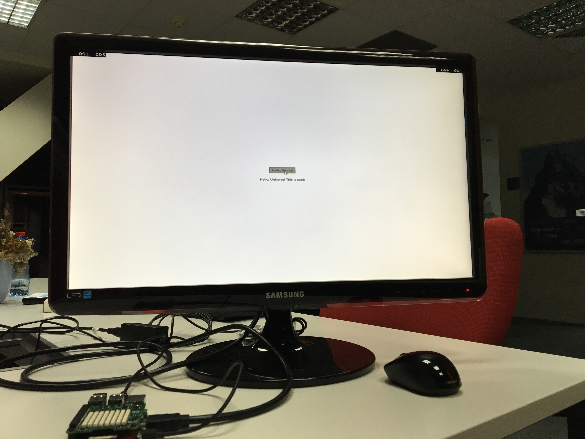

Session 2 - Getting started with UWP and Windows IoT Core
=========================================================

> Windows 10 introduces the Universal Windows Platform (UWP), which further evolves the Windows Runtime model and brings it into the Windows 10 unified core. As part of the core, the UWP now provides a common app platform available on every device that runs Windows 10. With this evolution, apps that target the UWP can call not only the WinRT APIs that are common to all devices, but also APIs (including Win32 and .NET APIs) that are specific to the device family the app is running on. The UWP provides a guaranteed core API layer across devices. This means you can create a single app package that can be installed onto a wide range of devices. And, with that single app package, the Windows Store provides a unified distribution channel to reach all the device types your app can run on.

> More on the [Official Microsoft Documentation](https://developer.microsoft.com/en-us/windows/apps/getstarted)

Basically, UWP allows you to write the application once for an multiple device families (such as desktop, mobile, IoT, Xbox, HoloLens) and be able to run it everywhere, keeping the application logic and modifying how the UI looks and behaves based on the device size or orientation.



For us, this means that we can run the same application on a laptop, phone or Raspberry Pi with Windows 10 IoT Core.

Next, we will discuss the two approaches to building applications for IoT devices:

Traditional UWP Apps - Headed devices
--------------------------------------

UWP applications just work on IoT Core just as they do on other Windows editions. The sample UWP application from Visual Studio will properly deploy on the IoT device (provided you set the target for an ARM device).

Let's write a very simple UWP application and deploy it to our Raspberry Pi. Start Visual Studio and create a new project.



First of all, we will add a button and a text block. In `MainPage.xaml`, the `Grid` element should look like this:

```
    <Grid Background="{ThemeResource ApplicationPageBackgroundThemeBrush}">
        <Button x:Name="button" Content="Hello, World!" HorizontalAlignment="Center" VerticalAlignment="Center" Click="button_Click"/>
        <TextBlock x:Name="textBlock" HorizontalAlignment="Center" Margin="0,100,0,0" TextWrapping="Wrap" Text="Nothing" VerticalAlignment="Center"/>
    </Grid>
```

You can also drag and drop elements from the Toolbox, so the page should look like this:



Then, in `MainPage.xaml.cs` add the method that reacts to the pressing of the button:

```
        private void button_Click(object sender, RoutedEventArgs e)
        {
            textBlock.Text = "Hello, Universe! This is cool!";
        }
```

At this point, we can run the application locally: Just press the `Local Machine` Button in Visual Studio:





We said that we will run the same application on the Raspberry Pi. First of all we need to change the target to ARM and select a Remote Device. If you don't have firewalls in your network, Visual Studio should see your device, otherwise just add the IP in the Manual Configuration field then deploy the application to the Raspberry.



You can find the complete application in the [SimpleRaspberryApplication](SimpleRaspberryApplication) folder.


Background Applications
-----------------------

In addition to the traditional UI apps, IoT Core has added a new UWP app type called “Background Applications”. These applications do not have a UI component, but instead have a class that implements the “IBackgroundTask” interface. They then register that class as a “StartupTask” to run at system boot. Since they are still UWP apps, they have access to the same set of APIs and are supported from the same language. The only difference is that there is no UI entry point.

Non-UWP Apps
------------

We also fully support traditional Win32 app types like Console Apps and NT Services. These apps are buit and run the same way as on Windows 10 Desktop. There is also an IoT Core C++ Console project template to make it easy to build from VS.

There are two main limitations on these non-UWP applications:

- no Win32 UI Apps - since there is no Win32 UI stack on IoT Core, no Win32 app will be able to directly display UI.
- C++ Apps Only: The only .Net Framework supported on IoT Core supports only UWP apps and so native Win32 apps are supported.


IoT Core supports a wide range of programming languages:

In-Box languages
----------------
Traditional UWP languages ship with support in Visual Studio by default. All of the In-Box languages support both UI and Background Applications
 
 * Languages
  * C#
  * C++
  * Javascript
  * Visual Basic

IoT Focused Languages
---------------------
 The IoT targeted languages require the download of the "Windows IoT Core Project Templates" from the Visual Studio **Tools->Extensions and Updates** manager.  The IoT Focused languages support only Background Applications. You can also build *Windows Runtime Components* using C#, C++, or Visual Basic and then reference those libraries from any other language (except Python).
* Languages
 * Arduino Wiring
 * Node.js
 * Python


> More information on [the Official Microsoft Documentation](https://developer.microsoft.com/en-us/windows/iot/docs/buildingappsforiotcore)

Conclusion
-----------

We built a very simple UWP application that we deployed to the Raspberry Pi. In the same way, we will build all UWP applications in this workshop.