Session 3 - Sending Device-to-Cloud messages
============================================

In this session we will start building an application that sends data to an Azure IoT Hub.

Creating an Azure IoT Hub
--------------------------

First of all, you need to create an Azure IoT Hub. In order to do this, [follow this detailed step-by-step tutorial](../../common/azure-iot-hub.md).

After you created the IoT Hub, should see something similar to this:


Installing the Device Explorer
------------------------------

[Device Explorer](https://github.com/Azure/azure-iot-sdks/releases/download/2016-11-17/SetupDeviceExplorer.msi) is a small application that allows the management and monitoring of the devices connected to an Azure IoT Hub.

After installing the application, start it, paste the **Connection string - primary key** in the connection string field from the **Configuration** tab and press the **Update** button.

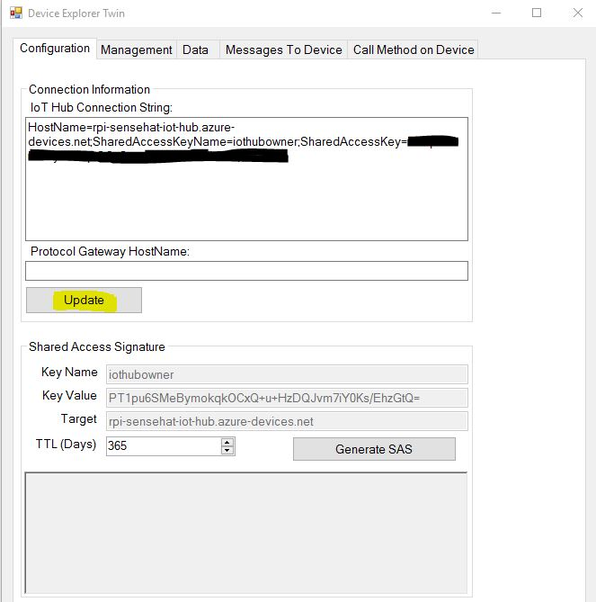

Then, in the **Management** tab click **Create** button to create a new device identity. Provide a device id or name, optionally modify the primary and secondary key and click **Create**. 

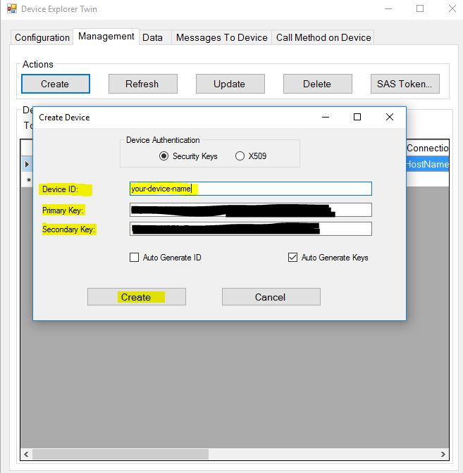

At this point, we can copy the **Connection string** that was created for our device and use it later in our application.

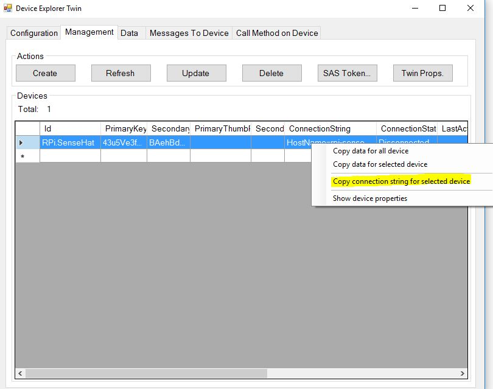

Unless we have this connection string that is associated with our IoT Hub instance, we will not be able to send data to the IoT Hub.

> There is also a [Node command line interface called iothub-explorer](https://github.com/Azure/iothub-explorer) that allows you to manage IoT Hub instances that we will use in Linux/Mac environments whwre the Device Exploerer application is not available. While you can also use it in Windows environments, it is recommended that you use the Device Explorer.

Create a UWP application that sends data to the IoT Hub
-------------------------------------------------------

In Visual Studio, create a **New Project** and under **Visual C#** choose the **Universal** tab. From there, choose the **Blank App(Universal Windows)** and press **Ok**.

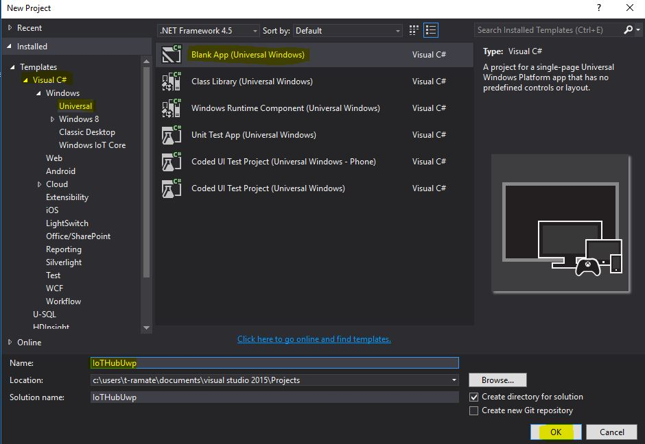

A new dialog appears prompting you to choose the minimum and the target version of Windows for your application. You can leave the default values and press **Ok**.

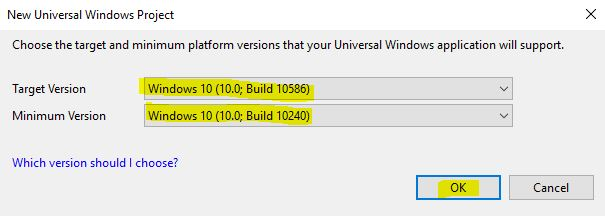

At this point, we will use a [Visual Studio Extension called **Connected Service for Azure IoT Hub**](http://aka.ms/azure-iot-hub-vs-cs-vs-gallery). Install the extension, then right click on the **References** section from **Solution Explorer**.

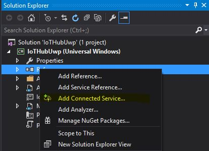

Then, select **Azure IoT Hub**.

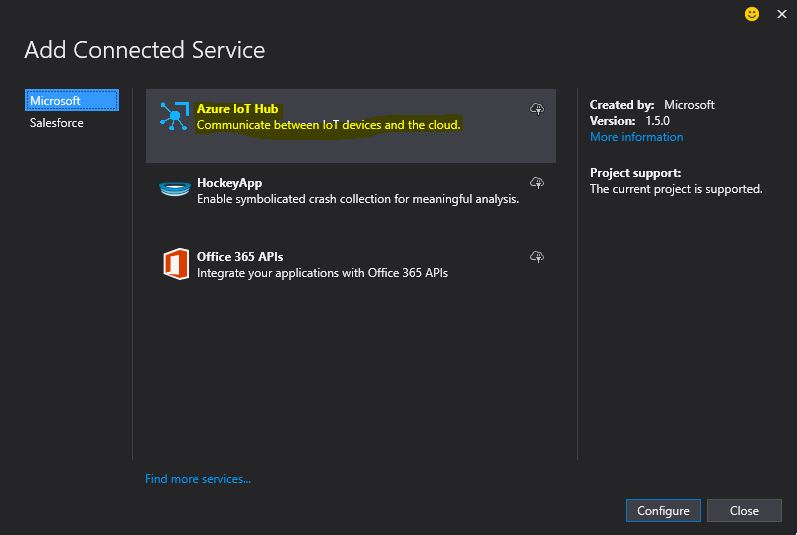

A dialog appears asking you to choose how to retrieve the connection string for thre communication between the application and the IoT Hub. At this point, we will use the Hardcoded option, since the option that retrieves the connection string stored on the device is still experimental.

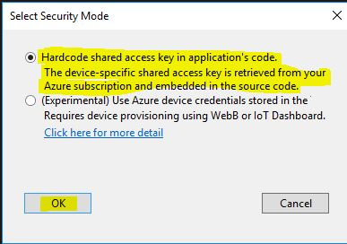

Reenter your credentials if prompted, then select the IoT Hub you just created.

> Notice that in this window you will see all instances of IoT Hub you created across your subscriptions.


After you choose the IoT Hub instance, you are prompted to either choose an existing device associated with the IoT Hub or create a new device. You can do both, but since we created a device earlier, we will use it.

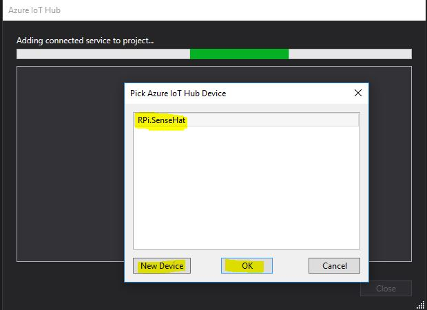

The Visual Studio extension will install a bunch of NuGet packages required for the communication with the IoT Hub.

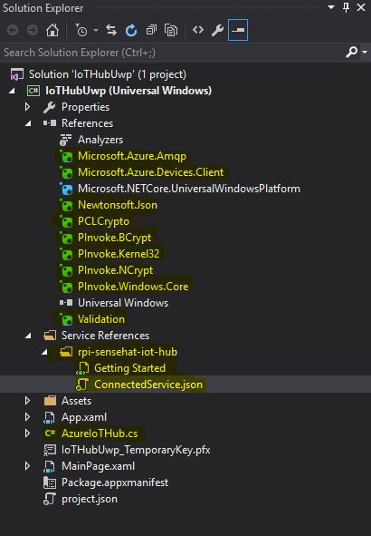

Together with the packages, this also adds a class called `AzureIoTHub.cs`.

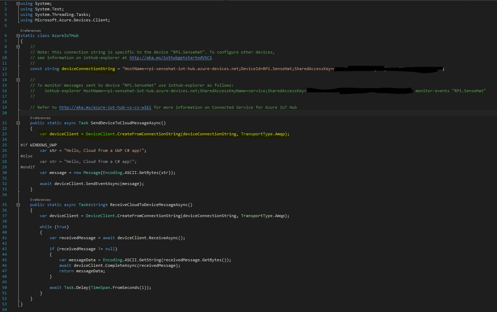

This is only a very simple demo and we will not use it. In fact, we will delete this class and add a new one called `IoTHubConnection`.

```
    public class IoTHubConnection : IDisposable
    {
        private DeviceClient _deviceClient { get; set; }

        public IoTHubConnection()
        {
            _deviceClient = DeviceClient.CreateFromConnectionString(GetConnectionString(), TransportType.Amqp));
        }

        public async Task SendEventAsync(string payload)
        {
            await _deviceClient.SendEventAsync(new Message(Encoding.ASCII.GetBytes(payload)));
        }

        private string GetConnectionString()
        {
            return "your-device-connection-string";
        }

        public void Dispose()
        {
            _deviceClient.Dispose();
        }
    }
```

This is a very simple implementation of a class that has a method that sends a `string` payload to an Azure IoT Hub. Notice that it implements the `IDisposable` interface since the `DeviceClient` class also implements it and we are using an instance of the `DeviceClient` class.

Then, in the `MainPage.xaml` add a `TextBlock` in the center of the screen.

```
<TextBlock x:Name="randomTextBlock" HorizontalAlignment="Center" TextWrapping="Wrap" Text="Placeholder" VerticalAlignment="Center"/>
```

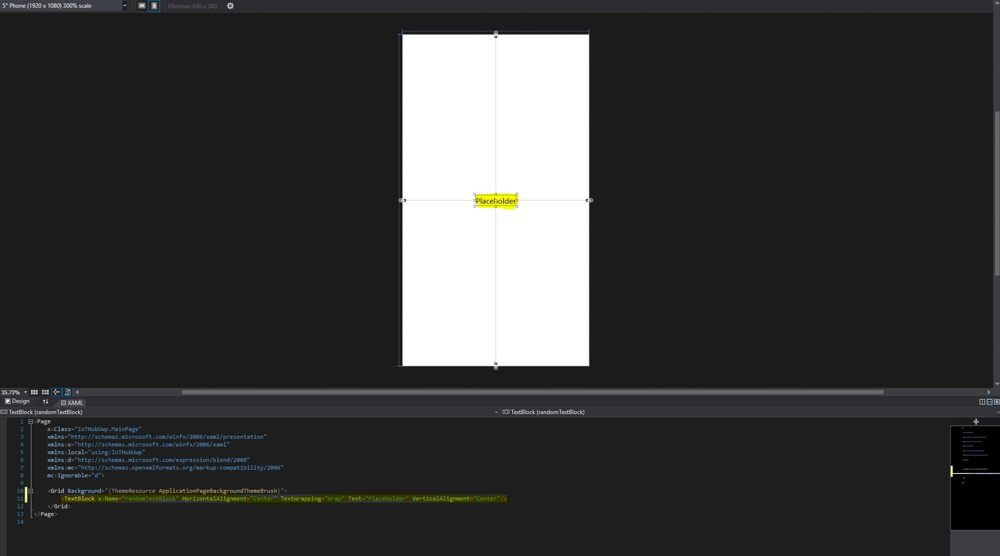


Then, in `MainPage.xaml.cs` add an event handler for the `Loaded` event that fires up when the page finised loading. In this event handler we will create a timer and every 3 seconds we will send a string to the IoT Hub.

```
    public sealed partial class MainPage : Page
    {
        public MainPage()
        {
            this.InitializeComponent();

            this.Loaded += (sender, eventArgs) =>
            {
                DispatcherTimer timer = new DispatcherTimer();

                timer.Tick += async (s, e) =>
                {
                    using (var iotHubConnection = new IoTHubConnection())
                    {
                        var message = $"Random string at {DateTime.Now}";
                        await iotHubConnection.SendEventAsync(message);
                        this.randomTextBlock.Text = message;
                    }
                };

                timer.Interval = TimeSpan.FromSeconds(3);
                timer.Start();
            };       
        }
    }
```

First we will run the application on the laptop and see if it really works. To verify, start the Device Exploerer application again and press the **Monitor** button under the **Data** tab and the application will start monitoring all messages that arrive from the device to IoT Hub. 

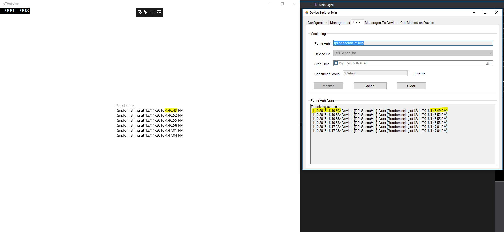


Running the application on the Raspberry Pi
-------------------------------------------

First of all, we need to find out the IP of our Raspberry. Normally, it should show up in the IoT Dashboard application under **My devices**, but if it doesn't, [see how to find the IP.](../session01#what-if-my-board-is-connected-to-network-but-doesnt-show-in-the-iot-dashboard-application).

To run on the Raspberry, first we need to change the target of the build to ARM.

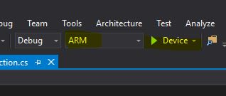

Then, click the **Device** dropdown and select a **Remote Device**. If your device was auto detected by Visual Studio (or by the IoT Dashboard app), it will applear here. Otherwise, enter the IP Address.


Then click the **Run** button. This will rebuild the application targeting ARM and will start the deployment to the Raspberry.

> If there is an error during the deployment: `Failed to establish connection to the device due to protocol incompatibility. Please try again, and if this error persists, please try restarting the target device. Device supports protocol 'Sirep2'.`, simply restart the Raspberry.

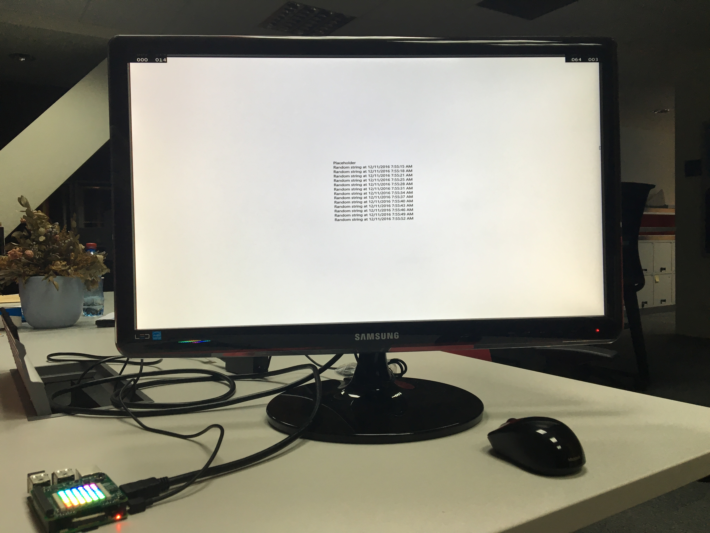

You can see that the same application is now running on the Raspberry and you can see the messages arriving in the IoT Hub with the Device Explorer.


Sending temperature telemetry to the Cloud
-------------------------------------------

So far we only sent some dummy text messages. Now it's time to send some temperature telemetry (either from some sensors or generated).

The `CloudTelemetry` solution contains 3 projects: 

- `CloudTelemetry.Common`, which contains the classes we will use in both cases: `TemperatureTelemetry` and `IoTHubConnection`
- `CloudTelemetry.Simulated`, which simulates some random temperature with values between 20 and 40
- `CloudTelemetry.SenseHat`, which uses the SenseHAT board to get the actual temperature

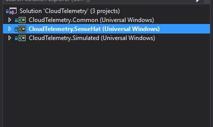

In order to run this application, first choose what project you will run: `CloudTelemetry.Simulated` or `CloudTelemetry.SenseHat` based on what device you have available.
When you device on the project, right click it and select **Set as StartUp Project**.


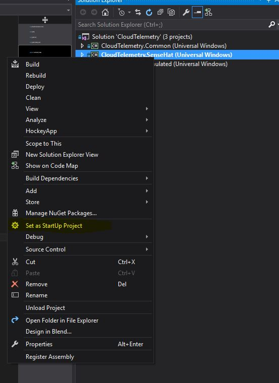


Then, just as earlier, deploy the application to the Raspberry and start debugging it.


Explaining the `CloudTelemetry.SenseHat` project
-------------------------------------------------

While the project where we simulate the temperature telemetry is pretty straightforward (we simple get a random double between 20 and 40 and send it to IoT Hub), the project where we get the data form the SenseHat has some additional moving parts: the `SenseHat` class:

```
    public class SenseHat : IDisposable
    {
        private ISenseHat _senseHat { get; set; }

        public async Task Activate()
        {
            _senseHat = await SenseHatFactory.GetSenseHat().ConfigureAwait(false);

            _senseHat.Display.Clear();
            _senseHat.Display.Update();
        }

        public TemperatureTelemetry GetTemperature()
        {
            while (true)
            {
                _senseHat.Sensors.HumiditySensor.Update();

                if (_senseHat.Sensors.Temperature.HasValue)
                {
                    return new TemperatureTelemetry()
                    {
                        Time = DateTime.UtcNow.AddHours(3).ToString("yyyy-MM-dd HH:mm:ss.fff"),
                        Temperature = Math.Round(_senseHat.Sensors.Temperature.Value, 2)
                    };
                }

                else new ManualResetEventSlim(false).Wait(TimeSpan.FromSeconds(0.5));
            }
        }

        public void Dispose()
        {
            _senseHat.Dispose();
        }
    }
```

> You can [find more details about how this class was created and more here](https://radu-matei.github.io/blog/rpi-sensehat-telemetry/#the-sense-hat-communication-project).

Basically, this is a class that only exposes functionality related with the temperature telemetry, but you can expand it to do all the things you want.

We obtain the actual object that does the communication with the board through a `SenseHatFactory` and we use this object throughout the class. In the `Activate` method, we get the reference ti the `ISenseHat` object through the factory, then turn the LED matrix off (we don't need to keep it on at all times).

The `GetTemperature` method is pretty straightforward: we check if the temperature sensor has value. If it does, we create a new `TemperatureTelemetry` object with the corresponding timestamp and temperature that we return. If the sensor doesn’t have a value, we wait half a second and try again.

In the same way we can see the data going in through the Device Explorer.

Conclusion
----------

We managed to create a very simple Universal Windows application that sends temperature telemetry (real or simulated) through IoT Hub.

Next steps
----------

Next, we will create some Cloud-to-Device messages that will make the LED matrix go on or off.